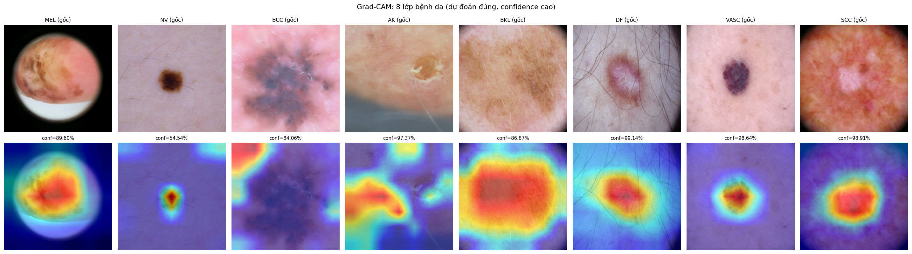

# 🩺 Skin Cancer Classification

### Ứng dụng mô hình **EfficientNet-B0** trong phân loại ung thư da từ ảnh Dermoscopy

---

## 📖 Giới thiệu

Đây là đồ án môn học **Trí Tuệ Nhân Tạo** với đề tài xây dựng hệ thống AI hỗ trợ chẩn đoán ung thư da từ ảnh **dermoscopy** (kính soi da). Hệ thống sử dụng kiến trúc **EfficientNet-B0** để phân loại **8 nhóm tổn thương da** trên bộ dữ liệu **ISIC 2019**, kèm theo ứng dụng web demo có khả năng giải thích quyết định của mô hình thông qua **Grad-CAM**.

### 🎯 Mục tiêu

- Xây dựng mô hình phân loại nhị phân **lành tính / ác tính** với độ chính xác cao
- Phân loại chi tiết **8 nhóm tổn thương da** phổ biến
- Trực quan hóa vùng chú ý của mô hình bằng **Grad-CAM** để tăng tính giải thích
- Triển khai ứng dụng web tiếng Việt có khả năng sinh khuyến nghị y khoa cụ thể

### ✨ Điểm nổi bật

|                             |                                                            |
| --------------------------- | ---------------------------------------------------------- |
| 🎯 **Độ chính xác cao**     | AUC-ROC 94.19%, Accuracy 86.7% trên tập test               |
| ⚖️ **Xử lý mất cân bằng**   | Class weights + Label smoothing cho dataset imbalance 54:1 |
| 🔍 **Explainable AI**       | Grad-CAM hiển thị vùng mô hình chú ý                       |
| 🇻🇳 **Giao diện tiếng Việt** | Web app với diễn giải tự động và khuyến nghị cụ thể        |
| ⚡ **Nhẹ & Nhanh**          | Chạy được trên CPU, model 16 MB                            |

---

## 📊 Kết quả nổi bật

| Chỉ số                   |  Binary Model  | Multi-class Model |
| :----------------------- | :------------: | :---------------: |
| **Bài toán**             | Lành / Ung thư | 8 nhóm tổn thương |
| **Accuracy**             |   **86.7%**    |       82.9%       |
| **Balanced Accuracy**    |       —        |     **78.2%**     |
| **AUC-ROC**              |   **94.2%**    |         —         |
| **Cohen's Kappa**        |       —        |     **74.7%**     |
| **F1-Score**             |     82.5%      |       75.3%       |
| **Precision**            |     81.9%      |         —         |
| **Recall (Sensitivity)** |   **85.8%**    |         —         |

### 🏆 So sánh với các nghiên cứu published

| Nghiên cứu             | Dataset   | Model               | Accuracy  |    AUC    |
| ---------------------- | --------- | ------------------- | :-------: | :-------: |
| **Đồ án này**          | ISIC 2019 | **EfficientNet-B0** | **82.9%** | **94.2%** |
| Tschandl et al. (2019) | ISIC 2018 | ResNet-50           |   79.2%   |   92.5%   |
| Gessert et al. (2020)  | ISIC 2019 | EfficientNet-B3     |   82.1%   |   94.6%   |
| Harangi et al. (2020)  | ISIC 2019 | Ensemble CNN        |   82.5%   |   94.9%   |
| Pham et al. (2021)     | ISIC 2019 | EfficientNet-B4     |   84.3%   |   95.1%   |

> 💡 Với model **nhỏ (B0, 5.3M params)**, đồ án đạt kết quả **cạnh tranh** với các nghiên cứu dùng model lớn hơn (B3, B4). Đánh đổi hợp lý giữa **hiệu năng** và **chi phí tính toán**.

---

## 🖼️ Demo

### Giao diện chính

### Kết quả phân tích

### Grad-CAM — Vùng mô hình chú ý

---

## 📑 Mục lục

- [Giới thiệu](#-giới-thiệu)
- [Kết quả nổi bật](#-kết-quả-nổi-bật)
- [Demo](#️-demo)
- [Kiến trúc hệ thống](#-kiến-trúc-hệ-thống)
- [Cấu trúc dự án](#-cấu-trúc-dự-án)
- [Cài đặt](#-cài-đặt)
- [Hướng dẫn sử dụng](#-hướng-dẫn-sử-dụng)
- [Chi tiết mô hình](#-chi-tiết-mô-hình)
- [Dataset](#-dataset)
- [Kết quả chi tiết](#-kết-quả-chi-tiết)
- [Hướng phát triển](#-hướng-phát-triển)
- [Tài liệu tham khảo](#-tài-liệu-tham-khảo)
- [License](#-license)

---

## 🏗️ Kiến trúc hệ thống
